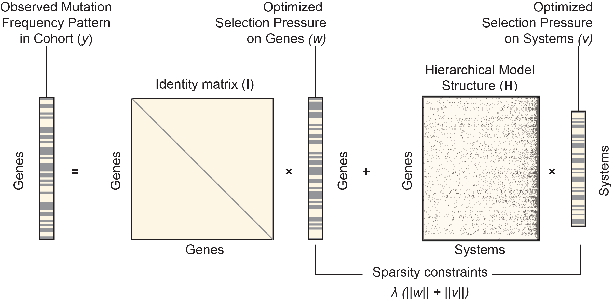

# HiSig 

# Introduction
HiSig is a method to identify a parsimonious list of gene sets (systems) to explain the signals associated with individual genes. It satisfies the purpose of Gene Set Enrichment Analysis, but substantially reduces the redundancy in results when provided gene sets that are overlapping or nested (e.g. the gene sets in the Gene Ontology, or other hierarchically structured gene sets). HiSig applies Lasso at multiple stringency of L1-regularization.

HiSig is one of the computational tools developed and described in the following study:

F. Zheng et al., [Interpretation of cancer mutations using a multiscale map of protein systems.](https://www.science.org/doi/10.1126/science.abf3067) Science 374, eabf3067 (2021).

## Updates

To simplify the workflow, HiSig now available as a self-contained R package.  

Install beta version via `devtools::install_github("fanzheng10/HiSig", subdir="HiSig")`. See a basic use case [here](https://github.com/fanzheng10/HiSig/blob/master/HiSig/examples/main.R). Documents and vignettes are under construction.

# Dependencies
* We tested on R 3.4, 3.5. Require libraries `glmnet` (we tested glmnet v2.0-18)
* Python package `statsmodels (v0.9)`, `numpy` and `scipy`.
* We recommend multiple CPU cores for efficient permutation test.

# Usage

Sample files are in the `/examples` directory.

## 1. prepare the input
One can start from a file describing a hierarchical model, which is a text file with 3 columns indicating the parent, child, and type of a relationship (see `sample.ont`; also see the [DDOT](https://github.com/idekerlab/ddot) package),  and another 2-column text file containing signals on leaf nodes in the hierarchical model (see `sample_genescore.tsv`). In our use case, leaf nodes are interpreted as genes and the signals on leaf nodes are interpreted as the number of observed mutations (which could have been appropriately adjusted or transformed) of each gene in a cancer cohort.  

Example usage:
`python prepare_input.py --ont sample.ont --sig sample_genescore.tsv --out sample_signal.txt`

After running `prepare_input.py`, one should get the following files:   
(1) A sparse binary matrix defining gene-to-system (genes as row; systems as columns) membership (in .txt format, see `sample_conn.txt`). It corresponds to in the `[I, H]` in the following figure. Here, `I` is an identity matrix since we treat individual genes as systems as well, in order to prevent systems where most signals can be explained by a single gene.  
(2) A text file with real values (see `sample_signals.txt`), genes in the input file (`sample_genescore.tsv`) but not in the hierarchy (`sample.ont`) will be omitted. It corresponds to the `y` vector in the following figure.  
(3) Two files called `genes.txt` and `terms.txt`, they will be needed in the step 3.

  

## 2. running Lasso regression

`R -f R/glmnet.R --args sample_conn.txt sample_signals.txt sample_ms_impact 10`

The first two arguments of this script are from the outputs of the previous step; the 3rd argument (`"sample_ms_impact"`) defines the file name of the R script output; the 4th argument (`"10"`) is for batch size of permutation. The batch number is 10 to enable parallelization. The number of total permutation is `batch_number * batch_size`, and thus it is 100 in the demo. By default, batch size is set to 1000, so it performs 10000 permutations.

**By default the script use 7 CPU cores; to change it, edit the `max_cores` in `glmnet.R` script**  
**P-values are calculated in an empirical distribution. So the minimum possible p-value depends on the number of permutations**

This step generates two outputs: `sample_ms_impact.coef` and `sample_ms_impact.impact-w-rand.tsv` (big files, not included in `/examples`)

## 3. parse the results

Use `parse.py` to parse the results. Example usage:

`python parse.py --ont_conn sample_conn.txt --rout sample_ms_impact.impact-w-rand.tsv --terms terms.txt --genes genes.txt --signal sample_signals.txt --out sample_ms_impact_summary.tsv`

The final result is `sample_ms_impact_summary.tsv`, in which each row is a gene set (system); gene sets are ordered by their q-value (Benjamini-Hochberg FDR). The columns `Mutation model input` and `Rank of model` represent genes' signals in the input and their ranks among all genes, to help understand the results.   
